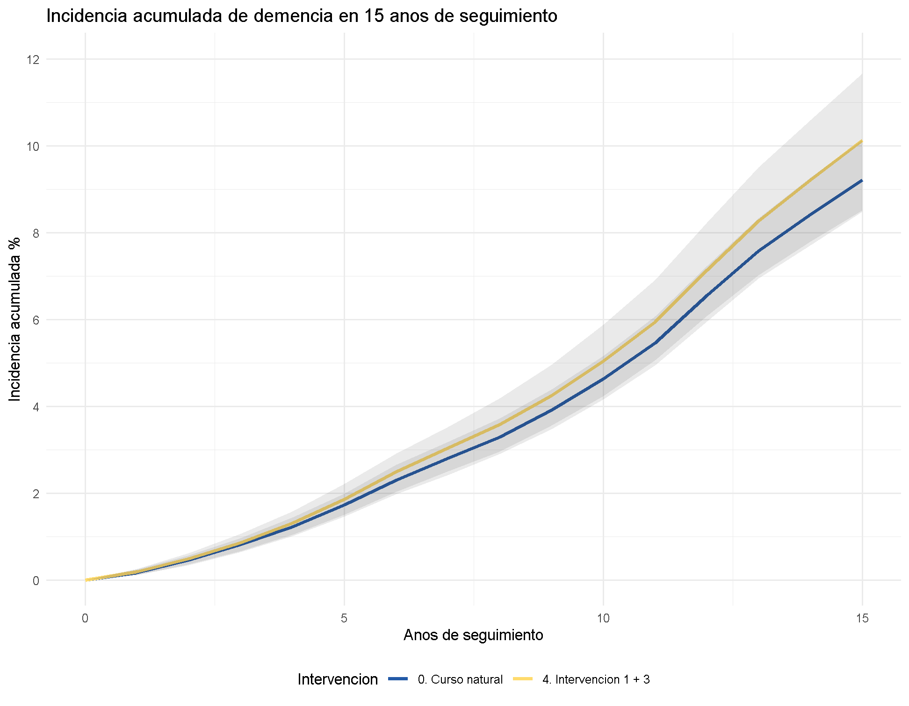

name: title
class: center, middle
#Implementing the G-methods in neurocognitive diseases#

L. Paloma Rojas Saunero

PhD Student

**Promotor:** Arfan Ikram         **Copromotor:** Sonja Swanson

**Epidemiology Department**

*Causal Inference Group - NeuroEpi Group*

.footnote[

]

---

name: title
class: center, middle

##What are the G-methods?##

---

## G-methods

- G methods are a family of methods that include the g-formula, marginal structural models, and structural nested models. 

--

- They provide consistent estimates of contrasts of average potential outcomes under a less restrictive set of identification conditions than standard regression methods.

--

- Specifically, standard regression requires no feedback between time-varying treatments and time-varying confounders, while G-methods do not.

---

.pull-left[
###Time-fixed interventions 

- One dose vaccine

- Surgery

- Traumatic brain injury

]

--

.pull-right[
###Time-varying interventions 

- Medication

- Diet

- Smoking

- Exercise

]

.footnote[DAG from Hernan MA, Robins JM (2019). Causal Inference.]
---
.footnote[DAG from Hernan MA, Robins JM (2019). Causal Inference.]

##Time-varying confounding

.pull-left[

###RCT's

]

--

.pull-right[
**Intention to treat (ITT) effect:**

What is the effect of randomization?

**Per protocol (PP) effect:**

What is the effect of the intervention had everyone followed the strategy over time?
]

---

##RCT's

Ideal RCTs to address mentioned interventions are inconclusive and limited because:

- Long follow up to observe the outcome

- Some interventions are not ethical

- Usually don't address joint interventions (requires multiple arms)

- There is time-dependent confounding

- Per protocol is not usually estimated

---

##Observational studies

.footnote[DAG's from Hernan MA, Robins JM (2019). Causal Inference.]

.pull-left[

]

.pull-right[
- Cohorts, electronic clinical records, registries

- Under certain assumptions we could estimate the causal effect of an exposure as if we were conducting an RCT.
]

---
name: title
class: center, middle

## Hypothetical interventions on systolic blood pressure and smoking to reduce the risk of stroke and dementia

---

##Motivation

- Stroke and dementia have a important burden in public health and share risk factors.

- Trials have focused on selected group of patients, have limited follow up and focus primarily on ITT.

- There is limited evidence on the **sustained effect** of _joint_ interventions in systolic blood pressure and quitting smoking

---

## Methods

- Participants from Rotterdam Study I, recruited between 1990-1993 and followed during 1993-1995, 1997-1999 and 2002-2005 (n = 7983)

- Eligibility criteria:

  + Persons below 80 years old
  
  + No prior history of stroke and no prior history of dementia diagnosis or MMSE below 26
  
  + Complete information at baseline
  
  + Final sample size of **5113** participants

---

## Hypothetical interventions 

- Natural course

--

- Mantain SBP below 120 mmHg

- Mantain SBP below 140 mmHg

- Reduce SBP by 10% if above 140

- Reduce SBP by 20% if above 140
 
--

- Quit smoking (if current smoker)

--

- Joint interventions of lowering SBP and quit smoking

---
##Outcome and Follow up

- Stroke 

- Dementia

- Follow up: 15 years since baseline 

- Lost to follow up is a **censoring** event *(skipped visits are part of lost to follow up)*

- Death is treated as a **competing** event

---
## Covariates

.pull-left[
**Baseline covariates:** 

- Age
- Education
- History of diabetes
- History of heart disease
- Baseline SBP
]

--

.pull-right[
**Time-varying covariates:** 

- Visit process
- SBP
- BMI
- Cigarrette smoking
- Alcohol intake (g/day)
- Cholesterol
- Hypertensive medications
- Development of: 
  - Diabetes
  - Heart disease
  - Cancer 
  - Stroke/Dementia]
  
---
  
##Analysis

.center[**_What would have happened had everyone was randomized and had adhered to each intervention (g)?_**]

- Parametric G-formula

- Allows presence of measured time-varying confounders (in addition to baseline confounding)

- Allows that measured time-varying confounders are themselves affected by past exposure

--

.pull-left[]

--

.pull-right[]

---

## Parametric G-formula

Extended version of standardization

1. Model A, L, Y, C separate, using covariate history

--

2. Select a random sample from the cohort and simulate  covariate and treatment history using estimated coefficients from step 1 using Monte Carlo simulation (of 10,000 subjects in our analyses).

--

3. Intervene by assigning the treatment value at each *t* according to the hypothetical intervention.

--

4. Estimate the predicted probability of the outcome based on the updated intervention

--

5. Calculate the average of the subject-specific risks and boostrap CI.

--

6. Repeat steps 2-5 for each hypothethical intervention.

---

## Assumptions

--

**Identifiability assumptions**

- Exchangeability: *No unmeasured confounding*

- Positivity: *Pr(A|L > 0)*

- Consistency: *Well-defined intervention*

--

**Modeling assumptions**

- No model misspecification

---

## The pitfalls

--
 **Time**

---

- Intervals between _visits_ are not symmetric.

---

- Interval within 2 visits are not symmetric across _individuals_.

---

- Some covariates are measured in during the visits, some are captured from
clinical records (dates of diagnose).

---

- **Solution:**

  - Model the visit process as covariates and simulate the visit process.

  - Model covariates conditioned on the visit process. 

--
.pull-left[

]

.pull-right[

]

---
### Assessing modeling

class: center, middle

---
## Results: Stroke
The observed risk at 15 years is **10.7%**. 

<table class="table table-hover table-responsive" style="font-size: 15px; margin-left: auto; margin-right: auto;">
 <thead>
  <tr>
   <th style="text-align:left;"> Intervention </th>
   <th style="text-align:left;"> Risk </th>
   <th style="text-align:left;"> Risk Ratio </th>
   <th style="text-align:left;"> Risk Difference </th>
   <th style="text-align:right;"> Total Intervened </th>
  </tr>
 </thead>
<tbody>
  <tr>
   <td style="text-align:left;"> 0. Natural course </td>
   <td style="text-align:left;"> 10.6 (9.6,11.8) </td>
   <td style="text-align:left;"> 1 (1, 1) </td>
   <td style="text-align:left;"> 0 (0, 0) </td>
   <td style="text-align:right;"> 0.0 </td>
  </tr>
  <tr>
   <td style="text-align:left;"> 1. Maintain SBP below 120 mmHg </td>
   <td style="text-align:left;"> 9.2 (7.7,11.1) </td>
   <td style="text-align:left;"> 0.9 (0.7, 1) </td>
   <td style="text-align:left;"> -1.4 (-2.8, 0.1) </td>
   <td style="text-align:right;"> 97.9 </td>
  </tr>
  <tr>
   <td style="text-align:left;"> 2. Maintain SBP below 140 mmHg </td>
   <td style="text-align:left;"> 9.5 (8.3,10.7) </td>
   <td style="text-align:left;"> 0.9 (0.8, 1) </td>
   <td style="text-align:left;"> -1.1 (-2, -0.5) </td>
   <td style="text-align:right;"> 83.5 </td>
  </tr>
  <tr>
   <td style="text-align:left;"> 3. Reduce SPB by 10% if above 140 </td>
   <td style="text-align:left;"> 9.3 (8.1,10.6) </td>
   <td style="text-align:left;"> 0.9 (0.8, 1) </td>
   <td style="text-align:left;"> -1.3 (-2.3, -0.4) </td>
   <td style="text-align:right;"> 83.5 </td>
  </tr>
  <tr>
   <td style="text-align:left;"> 4. Reduce SPB by 20% if above 140 </td>
   <td style="text-align:left;"> 9.3 (8,10.9) </td>
   <td style="text-align:left;"> 0.9 (0.8, 1) </td>
   <td style="text-align:left;"> -1.3 (-2.5, -0.2) </td>
   <td style="text-align:right;"> 83.5 </td>
  </tr>
  <tr>
   <td style="text-align:left;"> 5. Quit smoking (if current smoker) </td>
   <td style="text-align:left;"> 9.9 (8.8,11.2) </td>
   <td style="text-align:left;"> 0.9 (0.9, 1) </td>
   <td style="text-align:left;"> -0.8 (-1.3, -0.3) </td>
   <td style="text-align:right;"> 26.5 </td>
  </tr>
  <tr>
   <td style="text-align:left;"> 6. Joint 1 + 5 </td>
   <td style="text-align:left;"> 8.6 (7.1,10.5) </td>
   <td style="text-align:left;"> 0.8 (0.7, 0.9) </td>
   <td style="text-align:left;"> -2.1 (-3.5, -0.6) </td>
   <td style="text-align:right;"> 99.1 </td>
  </tr>
  <tr>
   <td style="text-align:left;"> 7. Joint 2 + 5 </td>
   <td style="text-align:left;"> 8.7 (7.6,10.1) </td>
   <td style="text-align:left;"> 0.8 (0.7, 0.9) </td>
   <td style="text-align:left;"> -1.9 (-2.8, -1.1) </td>
   <td style="text-align:right;"> 88.6 </td>
  </tr>
  <tr>
   <td style="text-align:left;"> 8. Joint 3 + 5 </td>
   <td style="text-align:left;"> 8.7 (7.5,10.1) </td>
   <td style="text-align:left;"> 0.8 (0.7, 0.9) </td>
   <td style="text-align:left;"> -2 (-3, -1.1) </td>
   <td style="text-align:right;"> 88.8 </td>
  </tr>
  <tr>
   <td style="text-align:left;"> 9. Joint 4 + 5 </td>
   <td style="text-align:left;"> 8.6 (7.3,10.3) </td>
   <td style="text-align:left;"> 0.8 (0.7, 0.9) </td>
   <td style="text-align:left;"> -2 (-3.2, -0.8) </td>
   <td style="text-align:right;"> 88.8 </td>
  </tr>
</tbody>
<tfoot>
<tr><td style="padding: 0; border: 0;" colspan="100%">Note: </td></tr>
<tr><td style="padding: 0; border: 0;" colspan="100%">
 Results with 500 bootstraps.</td></tr>
</tfoot>
</table>

---
## Results: Stroke

---
## Results: Stroke

---
## Results: Stroke

---
## Results: Stroke

---
## Results: Stroke

---
## Results: Stroke

---
## Results: Stroke

---
## Results: Stroke

---
## Results: Stroke

---
## Results: Dementia
The observed risk at 15 years is **9.15%**. 

<table class="table table-hover table-responsive" style="font-size: 15px; margin-left: auto; margin-right: auto;">
 <thead>
  <tr>
   <th style="text-align:left;"> Intervention </th>
   <th style="text-align:left;"> Risk </th>
   <th style="text-align:left;"> Risk Ratio </th>
   <th style="text-align:left;"> Risk Difference </th>
   <th style="text-align:right;"> Total Intervened </th>
  </tr>
 </thead>
<tbody>
  <tr>
   <td style="text-align:left;"> 0. Natural course </td>
   <td style="text-align:left;"> 9.2 (8.3,10.3) </td>
   <td style="text-align:left;"> 1 (1, 1) </td>
   <td style="text-align:left;"> 0 (0, 0) </td>
   <td style="text-align:right;"> 0.0 </td>
  </tr>
  <tr>
   <td style="text-align:left;"> 1. Maintain SBP below 120 mmHg </td>
   <td style="text-align:left;"> 10.1 (8.2,11.8) </td>
   <td style="text-align:left;"> 1.1 (0.9, 1.2) </td>
   <td style="text-align:left;"> 0.8 (-0.6, 2.2) </td>
   <td style="text-align:right;"> 98.2 </td>
  </tr>
  <tr>
   <td style="text-align:left;"> 2. Maintain SBP below 140 mmHg </td>
   <td style="text-align:left;"> 9.4 (8.2,10.7) </td>
   <td style="text-align:left;"> 1 (0.9, 1.1) </td>
   <td style="text-align:left;"> 0.2 (-0.5, 0.9) </td>
   <td style="text-align:right;"> 84.3 </td>
  </tr>
  <tr>
   <td style="text-align:left;"> 3. Reduce SPB by 10% if above 140 </td>
   <td style="text-align:left;"> 9.5 (8.2,11) </td>
   <td style="text-align:left;"> 1 (0.9, 1.1) </td>
   <td style="text-align:left;"> 0.3 (-0.5, 1.1) </td>
   <td style="text-align:right;"> 84.0 </td>
  </tr>
  <tr>
   <td style="text-align:left;"> 4. Reduce SPB by 20% if above 140 </td>
   <td style="text-align:left;"> 9.7 (8.3,11.4) </td>
   <td style="text-align:left;"> 1.1 (0.9, 1.2) </td>
   <td style="text-align:left;"> 0.5 (-0.6, 1.8) </td>
   <td style="text-align:right;"> 84.0 </td>
  </tr>
  <tr>
   <td style="text-align:left;"> 5. Quit smoking (if current smoker) </td>
   <td style="text-align:left;"> 9.4 (8.4,10.4) </td>
   <td style="text-align:left;"> 1 (1, 1.1) </td>
   <td style="text-align:left;"> 0.1 (-0.3, 0.5) </td>
   <td style="text-align:right;"> 26.4 </td>
  </tr>
  <tr>
   <td style="text-align:left;"> 6. Joint 1 + 5 </td>
   <td style="text-align:left;"> 10.1 (8.3,12) </td>
   <td style="text-align:left;"> 1.1 (0.9, 1.3) </td>
   <td style="text-align:left;"> 0.9 (-0.6, 2.5) </td>
   <td style="text-align:right;"> 98.9 </td>
  </tr>
  <tr>
   <td style="text-align:left;"> 7. Joint 2 + 5 </td>
   <td style="text-align:left;"> 9.5 (8.3,10.8) </td>
   <td style="text-align:left;"> 1 (1, 1.1) </td>
   <td style="text-align:left;"> 0.3 (-0.5, 1.1) </td>
   <td style="text-align:right;"> 89.6 </td>
  </tr>
  <tr>
   <td style="text-align:left;"> 8. Joint 3 + 5 </td>
   <td style="text-align:left;"> 9.7 (8.3,11) </td>
   <td style="text-align:left;"> 1.1 (1, 1.1) </td>
   <td style="text-align:left;"> 0.4 (-0.5, 1.3) </td>
   <td style="text-align:right;"> 89.1 </td>
  </tr>
  <tr>
   <td style="text-align:left;"> 9. Joint 4 + 5 </td>
   <td style="text-align:left;"> 9.9 (8.3,11.6) </td>
   <td style="text-align:left;"> 1.1 (0.9, 1.2) </td>
   <td style="text-align:left;"> 0.7 (-0.6, 2) </td>
   <td style="text-align:right;"> 89.1 </td>
  </tr>
</tbody>
<tfoot>
<tr><td style="padding: 0; border: 0;" colspan="100%">Note: </td></tr>
<tr><td style="padding: 0; border: 0;" colspan="100%">
 Results with 500 bootstraps.</td></tr>
</tfoot>
</table>
---
## Results: Dementia

---
## Results: Dementia

---
## Results: Dementia

---
## Results: Dementia

---
## Results: Dementia

---
## Results: Dementia

---
## Results: Dementia

---
## Results: Dementia

---
## Results: Dementia

---
## Conclusion

- All interventions decrease the risk of stroke at 15 years.

- Joint interventions decrease the risk of stroke even more.

- There is no effect of interventions in the risk of dementia at 15 years.

---

name: title
class: center, middle

## The problem with the competing events##

---
### What happens to the risk of death when stroke is the main outcome?

---
### What happens to the risk of death when dementia is the main outcome?

---

### Beyond the subhazard and cause-specific dichotomy

.center[]

.footnote[Austin et al. A tutorial on competing risks. Circulation. 2016]
---

###What if we could frame our causal question in different ways?

.pull-left[

$Pr[Y_{k+1}^{a,c=0, d=0} = 1]$

_What is the risk of the event, if we could prevent death?_

The treatment's effect on the event of interest not mediated by the competing event: **Direct Effect**  

*Death is treated as a censoring event*

]

.pull-right[

$Pr[Y_{k+1}^{a,c=0} = 1]$

_What is the risk of the event if we do not eliminate de competing event?_

The treatment's effect on the event of interest through all causal pathways between treatment and the event of interest, includding those possibly mediated by the competing event: **Total Effect**  

*Death is not treated as a censoring event, but as a covariate*
]

---
## From theory to the real setting

- In aging related research death will always be a competing event to worry about (death can represent 2x/3x the risk of our outcome of interest)

- The magnitude of the difference between the two estimates can be driven by the effect of the intervention in the competing event

- We need to explore which assumption would we be willing to take in real-case scenarios, and explore in which scenarios these estimates could bring opposite effects.

---

### Apoe 4: Crude cumulative incidence

---

### Apoe: Adjusted survival curves

.pull-left[

#### Direct Effect

]

.pull-right[
#### Total Effect

]

`y_model <- c("exposure*(time)", "sex", "age_0", "smoke_cig1")`

`d_model <- c("exposure*(time)", "sex", "age_0", "smoke_cig1", "ht1")`

---

### Time-fixed hypertension: Crude cumulative incidence

---
### Time-fixed hypertension: Adjusted survival curves

.pull-left[
#### Direct Effect

]

.pull-right[
#### Total Effect

]

---

### Time-fixed smoking (never vs. current or former): Crude cumulative incidence

---

### Time-fixed smoking (never vs. current or former): Adjusted survival curves

.pull-left[

#### Direct Effect

]

.pull-right[
#### Total Effect

]

---

## Takehome messages

- Observational studies can be used to emulate a target trial.

- G-formula will help us solve the issue with time varying confounding.

- For longitudinal analysis, comprehension of data generating mechanism is key.

- Competing risk analysis is beyond a statistical choice, it should be adopted as part of the causal question.

---
## Acknowledgements

- Causal inference group

- Neuroepi group

---

## Thank you!

.center[]
